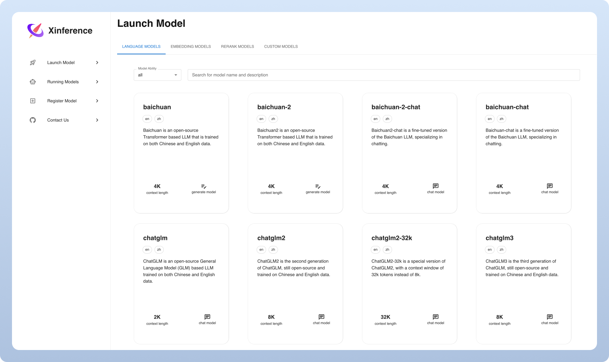
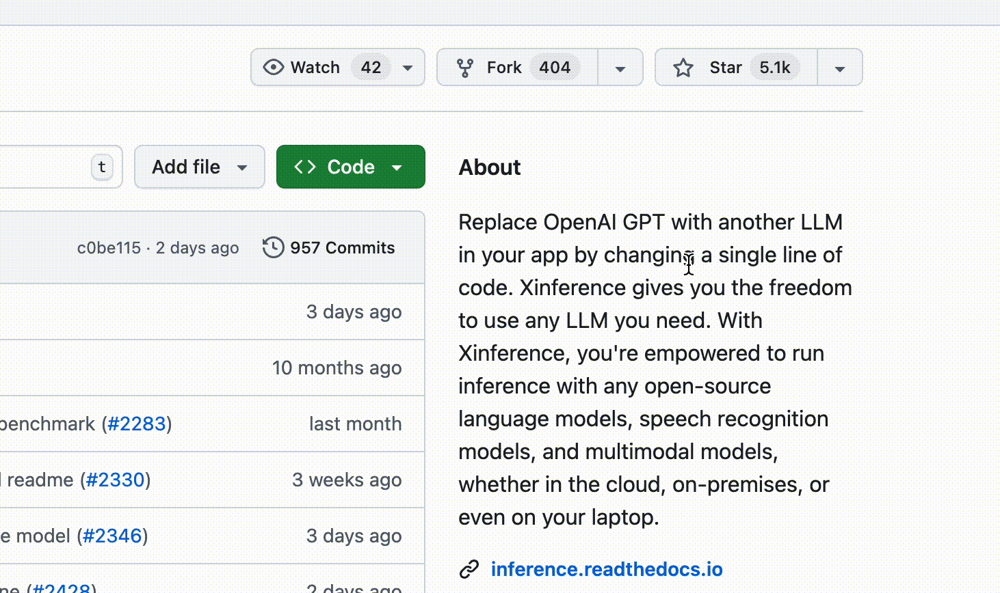

<div align="center">


# Wolinet AI Inference Platform 🤖

**Sovereign, High-Performance Model Serving for LLMs, Multimodal, and Embedding Models**

<p align="center">
  <a href="https://wolinet.ai">Wolinet AI</a> ·
  <a href="https://github.com/wolinet-renatus/inference">GitHub</a> ·
  <a href="https://inference.readthedocs.io/">Upstream Docs</a>
</p>

[](https://github.com/wolinet-renatus/inference/blob/main/LICENSE)
[](https://www.python.org/)
[](https://platform.openai.com/docs/api-reference)

</div>
<br />

Wolinet AI Inference Platform is a sovereign, production-ready inference engine for deploying and
serving large language models, speech recognition, image generation, and multimodal models.
Built on the Xinference engine, it provides zero-cost local inference with automatic model
downloading, OpenAI-compatible REST APIs, and a full management dashboard — all under the
Wolinet AI brand.

<div align="center">
<i>🚀 Deploy AI models locally or in the cloud with zero token costs &nbsp;·&nbsp; OpenAI-compatible APIs &nbsp;·&nbsp; Full Web Dashboard</i>
</div>


## 🔥 Hot Topics
### Framework Enhancements
- The upstream engine 3.0.0 is available with migration notes and breaking changes: [Release Notes](https://xinference.co/release_notes/v3.0.0.html)
- Agent-native Serving: The platform integrates with [Xagent](https://github.com/xorbitsai/xagent) to enable dynamic planning, tool use, and autonomous multi-step reasoning — moving beyond static pipelines.
- Auto batch: Multiple concurrent requests are automatically batched, significantly improving throughput: [#4197](https://github.com/xorbitsai/inference/pull/4197)
- [Xllamacpp](https://github.com/xorbitsai/xllamacpp): New llama.cpp Python binding, maintained by Xorbits team, supports continuous batching and is more production-ready.: [#2997](https://github.com/xorbitsai/inference/pull/2997)
- Distributed inference: running models across workers: [#2877](https://github.com/xorbitsai/inference/pull/2877)
- VLLM enhancement: Shared KV cache across multiple replicas: [#2732](https://github.com/xorbitsai/inference/pull/2732)
### New Models
- Built-in support for [MiniCPM5-2B](https://huggingface.co/openbmb/MiniCPM5-2B): [#5506](https://github.com/xorbitsai/inference/pull/5506)
- Built-in support for Fish Audio series ([S1-mini](https://huggingface.co/fishaudio/s1-mini), [S2-Pro](https://huggingface.co/fishaudio/s2-pro)): [#5490](https://github.com/xorbitsai/inference/pull/5490)
- Built-in support for [MonkeyOCR](https://huggingface.co/echo840/MonkeyOCR): [#5475](https://github.com/xorbitsai/inference/pull/5475)
- Built-in support for [dots.ocr](https://huggingface.co/rednote-hilab/dots.ocr): [#5468](https://github.com/xorbitsai/inference/pull/5468)
- Built-in support for JoyAI image editing series ([Edit](https://huggingface.co/jdopensource/JoyAI-Image-Edit-Diffusers), [Edit Plus](https://huggingface.co/jdopensource/JoyAI-Image-Edit-Plus-Diffusers)): [#5458](https://github.com/xorbitsai/inference/pull/5458)
- Built-in support for [Breeze-TTS-2](https://huggingface.co/BreezeBlue/Breeze-TTS-2): [#5437](https://github.com/xorbitsai/inference/pull/5437)
- Built-in support for WeMM-Embedding series ([2B](https://huggingface.co/tencent/WeMM-Embedding-2B), [4B](https://huggingface.co/tencent/WeMM-Embedding-4B), [9B](https://huggingface.co/tencent/WeMM-Embedding-9B)): [#5439](https://github.com/xorbitsai/inference/pull/5439)
- Built-in support for [NaviDC-OCR](https://huggingface.co/StarDoc-AI/NaviDC-OCR): [#5431](https://github.com/xorbitsai/inference/pull/5431)
- Built-in support for [Kimi-K3](https://huggingface.co/moonshotai/Kimi-K3): [#5417](https://github.com/xorbitsai/inference/pull/5417)
- Built-in support for world models ([Matrix-Game-3.0-5B](https://huggingface.co/Skywork/Matrix-Game-3.0), [HY-WorldPlay-5B](https://huggingface.co/tencent/HY-WorldPlay), [Astra](https://huggingface.co/EvanEternal/Astra)): [#5414](https://github.com/xorbitsai/inference/pull/5414)
- Built-in support for Krea 2 series ([Raw](https://huggingface.co/krea/Krea-2-Raw), [Turbo](https://huggingface.co/krea/Krea-2-Turbo)): [#5419](https://github.com/xorbitsai/inference/pull/5419)
- Built-in support for [ACE-Step 1.5](https://huggingface.co/ACE-Step/Ace-Step1.5): [#5413](https://github.com/xorbitsai/inference/pull/5413)
- Built-in support for Ornith 1.5 series ([35B-A3B](https://modelscope.cn/models/ornith-ai/Ornith-1.5-35B-A3B), [397B](https://modelscope.cn/models/ornith-ai/Ornith-1.5-397B)): [#5406](https://github.com/xorbitsai/inference/pull/5406), [#5405](https://github.com/xorbitsai/inference/pull/5405)
- Built-in support for [GLM-5.2](https://huggingface.co/zai-org/GLM-5.2): [#5404](https://github.com/xorbitsai/inference/pull/5404)
- Built-in support for [GLM-Image](https://huggingface.co/zai-org/GLM-Image): [#5394](https://github.com/xorbitsai/inference/pull/5394)
- Built-in support for HiDream-O1 series ([Image](https://huggingface.co/HiDream-ai/HiDream-O1-Image), [Image-Dev](https://huggingface.co/HiDream-ai/HiDream-O1-Image-Dev), [Image-Dev-2604](https://huggingface.co/HiDream-ai/HiDream-O1-Image-Dev-2604)): [#5370](https://github.com/xorbitsai/inference/pull/5370)
- Built-in support for [SenseNova-U1.5-8B-MoT](https://huggingface.co/sensenova/SenseNova-U1.5-8B-MoT): [#5369](https://github.com/xorbitsai/inference/pull/5369)
- Built-in support for [Ideogram4](https://huggingface.co/ideogram-ai/ideogram-4-nf4-diffusers): [#5367](https://github.com/xorbitsai/inference/pull/5367)
- Built-in support for [DeepSeek-V4-Flash-0731](https://huggingface.co/deepseek-ai/DeepSeek-V4-Flash-0731): [#5371](https://github.com/xorbitsai/inference/pull/5371)
- Built-in support for [FireRedTTS3](https://huggingface.co/FireRedTeam/FireRedTTS3): [#5352](https://github.com/xorbitsai/inference/pull/5352)
- Built-in support for [MiniMax-H3 Lightning LoRA](https://huggingface.co/lightx2v/Minimax-h3-Turbo): [#5338](https://github.com/xorbitsai/inference/pull/5338)
- Built-in support for [MiniMax-Music3](https://huggingface.co/MiniMaxAI/MiniMax-Music3): [#5345](https://github.com/xorbitsai/inference/pull/5345)
- Built-in support for Qwen3.8 series ([27B](https://huggingface.co/Qwen/Qwen3.8-27B), [2.4T-A95B](https://huggingface.co/Qwen/Qwen3.8-2.4T-A95B)): [#5337](https://github.com/xorbitsai/inference/pull/5337), [#5339](https://github.com/xorbitsai/inference/pull/5339)
- Built-in support for [jina-reranker-m0](https://huggingface.co/jinaai/jina-reranker-m0): [#5327](https://github.com/xorbitsai/inference/pull/5327)
### Integrations
- [Xagent](https://github.com/xorbitsai/xagent): an enterprise agent platform for building and running AI agents with planning, memory, and tool use — not limited to rigid workflows.
- [Dify](https://docs.dify.ai/advanced/model-configuration/xinference): an LLMOps platform that enables developers (and even non-developers) to quickly build useful applications based on large language models, ensuring they are visual, operable, and improvable.
- [FastGPT](https://github.com/labring/FastGPT): a knowledge-based platform built on the LLM, offers out-of-the-box data processing and model invocation capabilities, allows for workflow orchestration through Flow visualization.
- [RAGFlow](https://github.com/infiniflow/ragflow): is an open-source RAG engine based on deep document understanding.
- [MaxKB](https://github.com/1Panel-dev/MaxKB): MaxKB = Max Knowledge Brain, it is a powerful and easy-to-use AI assistant that integrates Retrieval-Augmented Generation (RAG) pipelines, supports robust workflows, and provides advanced MCP tool-use capabilities.


## Key Features
🌟 **Model Serving Made Easy**: Simplify the process of serving large language, speech 
recognition, and multimodal models. You can set up and deploy your models
for experimentation and production with a single command.

⚡️ **State-of-the-Art Models**: Experiment with cutting-edge built-in models using a single 
command. Inference provides access to state-of-the-art open-source models!

🖥 **Heterogeneous Hardware Utilization**: Make the most of your hardware resources with
[ggml](https://github.com/ggerganov/ggml). Xorbits Inference intelligently utilizes heterogeneous
hardware, including GPUs and CPUs, to accelerate your model inference tasks.

⚙️ **Flexible API and Interfaces**: Offer multiple interfaces for interacting
with your models, supporting OpenAI compatible RESTful API (including Function Calling API), RPC, CLI 
and WebUI for seamless model management and interaction.

🌐 **Distributed Deployment**: Excel in distributed deployment scenarios, 
allowing the seamless distribution of model inference across multiple devices or machines.

🔌 **Built-in Integration with Third-Party Libraries**: Xorbits Inference seamlessly integrates
with popular third-party libraries including [LangChain](https://python.langchain.com/docs/integrations/providers/xinference), [LlamaIndex](https://gpt-index.readthedocs.io/en/stable/examples/llm/XinferenceLocalDeployment.html#i-run-pip-install-xinference-all-in-a-terminal-window), [Dify](https://docs.dify.ai/advanced/model-configuration/xinference), and [Chatbox](https://chatboxai.app/).

## Why Wolinet AI Inference
| Feature                                        | Wolinet AI | FastChat | OpenLLM | RayLLM |
|------------------------------------------------|------------|----------|---------|--------|
| OpenAI-Compatible RESTful API                  | ✅ | ✅ | ✅ | ✅ |
| vLLM Integrations                              | ✅ | ✅ | ✅ | ✅ |
| More Inference Engines (GGML, TensorRT)        | ✅ | ❌ | ✅ | ✅ |
| More Platforms (CPU, Metal)                    | ✅ | ✅ | ❌ | ❌ |
| Multi-node Cluster Deployment                  | ✅ | ❌ | ❌ | ✅ |
| Image Models (Text-to-Image)                   | ✅ | ✅ | ❌ | ❌ |
| Text Embedding Models                          | ✅ | ❌ | ❌ | ❌ |
| Multimodal Models                              | ✅ | ❌ | ❌ | ❌ |
| Audio Models                                   | ✅ | ❌ | ❌ | ❌ |
| More OpenAI Functionalities (Function Calling) | ✅ | ❌ | ❌ | ❌ |

## Using Wolinet AI Inference

- **Self-hosting Wolinet AI Inference</br>**
Quickly get Wolinet AI Inference running in your environment with this [starter guide](#getting-started).
Use our [documentation](https://inference.readthedocs.io/) for further references and more in-depth instructions.

- **Wolinet AI for enterprise / organizations</br>**
We provide additional enterprise-centric features. [send us an email](mailto:info@wolinet.ai?subject=[GitHub]Business%20License%20Inquiry) to discuss enterprise needs. </br>

## Staying Ahead

Star Wolinet AI Inference on GitHub and be instantly notified of new releases.



## Getting Started

* [Docs](https://inference.readthedocs.io/en/latest/index.html)
* [Built-in Models](https://inference.readthedocs.io/en/latest/models/builtin/index.html)
* [Custom Models](https://inference.readthedocs.io/en/latest/models/custom.html)
* [Deployment Docs](https://inference.readthedocs.io/en/latest/getting_started/using_xinference.html)

### Docker 

Nvidia GPU users can start the inference server using the [Docker Image](https://inference.readthedocs.io/en/latest/getting_started/using_docker_image.html). Prior to executing the installation command, ensure that both [Docker](https://docs.docker.com/get-docker/) and [CUDA](https://developer.nvidia.com/cuda-downloads) are set up on your system.

```bash
docker run --name xinference -d -p 9997:9997 -e XINFERENCE_HOME=/data -v </on/your/host>:/data --gpus all xprobe/xinference:latest xinference-local -H 0.0.0.0
```

### K8s via helm

Ensure that you have GPU support in your Kubernetes cluster, then install as follows.

```
# add repo
helm repo add xinference https://xorbitsai.github.io/xinference-helm-charts  # upstream chart

# update indexes and query xinference versions
helm repo update xinference
helm search repo xinference/xinference --devel --versions

# install xinference
helm install xinference xinference/xinference -n xinference --version 0.0.1-v<xinference_release_version>
```

For more customized installation methods on K8s, please refer to the [documentation](https://inference.readthedocs.io/en/latest/getting_started/using_kubernetes.html).

### Quick Start

Install Wolinet AI Inference using pip as follows. (For more options, see [Installation page](https://inference.readthedocs.io/en/latest/getting_started/installation.html).)

```bash
pip install "xinference[all]"
```

To start a local instance of Wolinet AI Inference, run the following command:

```bash
$ xinference-local
```

Once Wolinet AI Inference is running, there are multiple ways you can try it: via the web UI, via cURL,
 via the command line, or via the Xinference’s python client. Visit the dashboard at [http://127.0.0.1:9997](http://127.0.0.1:9997) to get started.


## Getting Involved

| Platform                                                              | Purpose                                           |
|-----------------------------------------------------------------------|---------------------------------------------------|
| [GitHub Issues](https://github.com/wolinet-renatus/inference/issues)  | Reporting bugs and filing feature requests.       |
| [Wolinet AI](https://wolinet.ai)                                      | Wolinet AI platform and enterprise solutions.     |

## Built On

Wolinet AI Inference is built on [Xinference](https://github.com/xorbitsai/inference) by Xorbits.
If you use the underlying Xinference engine in academic work, please cite:

```bibtex
@inproceedings{lu2024xinference,
    title = "Xinference: Making Large Model Serving Easy",
    author = "Lu, Weizheng and Xiong, Lingfeng and Zhang, Feng and Qin, Xuye and Chen, Yueguo",
    booktitle = "Proceedings of the 2024 Conference on Empirical Methods in Natural Language Processing: System Demonstrations",
    month = nov,
    year = "2024",
    address = "Miami, Florida, USA",
    publisher = "Association for Computational Linguistics",
    url = "https://aclanthology.org/2024.emnlp-demo.30",
    pages = "291--300",
}
```
